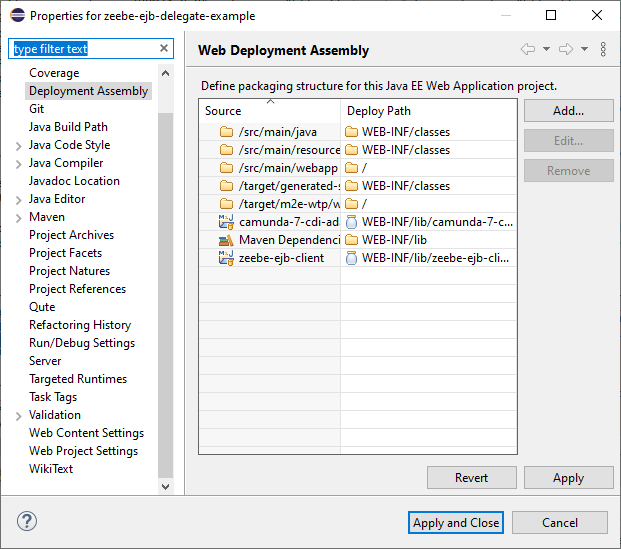

# Running Wildfly in Eclipse

The most important part to start the application in a server controlled by
Eclipse correctly, is the Deployment Assembly from the project properties. Here
you have to make shure, that all maven dependencies and references projects are
added:



Otherwise, you will get class not found exceptions in the runtime.

## beans.xml

Check for the `beams.xml` file under `src/main/webapp/WEB-INF`.

An empty content example:

```
<?xml version="1.0"?>
<beans
  xmlns="http://java.sun.com/xml/ns/javaee"
  xmlns:xsi="http://www.w3.org/2001/XMLSchema-instance"
  xsi:schemaLocation="http://java.sun.com/xml/ns/javaee http://jboss.org/schema/cdi/beans_1_0.xsd">

</beans>
```
